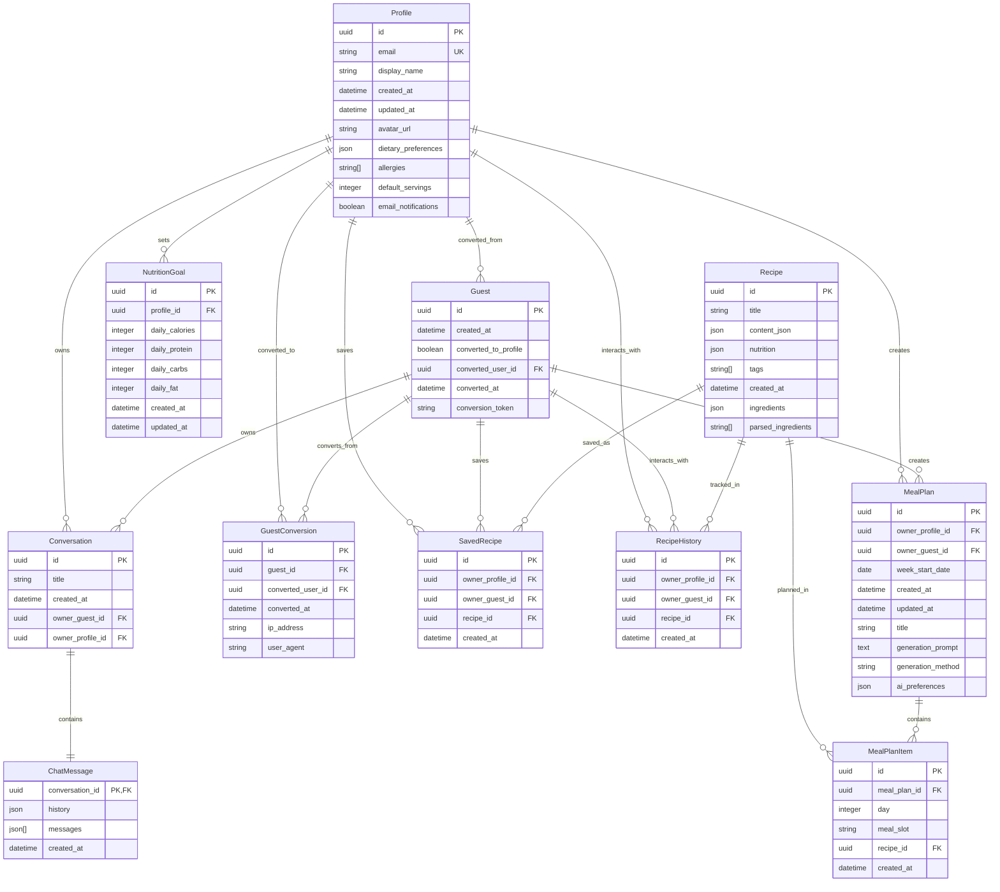

# MonAmiChef MVP Database Schema (Complete September 2025)

## Entity Relationship Diagram



## Database Overview

### Core Architecture

**MonAmiChef MVP** (Complete September 2025) uses a PostgreSQL database with 11 main tables supporting:
- **User Management**: Both registered users (`Profile`) and anonymous users (`Guest`)
- **Chat System**: AI-powered conversations with message history
- **Recipe Management**: Recipe storage, saving, and interaction tracking
- **Meal Planning**: Weekly meal planning with recipe assignments
- **Grocery Lists**: Auto-generated shopping lists from meal plans
- **Nutrition Tracking**: Goal setting and progress monitoring
- **User Conversion**: Seamless upgrade from guest to registered user

### Table Descriptions

#### **Profile** (Enhanced for MVP)
- Registered users with authentication via Supabase
- Enhanced with meal planning preferences: dietary preferences, allergies, default servings
- Email notification settings for meal planning reminders
- Links to all user-owned content and meal plans

#### **Guest** (Unchanged)
- Anonymous users who can use the app without registration
- Can create meal plans and save recipes before converting
- Tracks conversion status and token for upgrading to full account
- Maintains data continuity during conversion process

#### **Conversation** (Unchanged)
- Chat conversations with AI assistant
- Can be owned by either Profile or Guest users
- Stores conversation metadata and title
- Foundation for AI meal plan generation

#### **ChatMessage** (Unchanged)
- Stores the actual message content and AI interaction history
- One-to-one relationship with Conversation
- Uses JSON fields for flexible message structure
- Core engine for AI recipe generation

#### **Recipe** (Enhanced for MVP)
- Core recipe data with structured content
- Enhanced with ingredient parsing: `ingredients` JSON and `parsed_ingredients` array
- Includes detailed nutrition information for meal planning
- Tagging system for recipe discovery and categorization
- Can be assigned to meal plan slots

#### **SavedRecipe** (Unchanged)
- User's personal recipe collection
- Supports both Profile and Guest ownership
- Prevents duplicate saves per user
- Bridge to meal planning workflow

#### **RecipeHistory** (Unchanged)
- Tracks user interactions with recipes
- Analytics and recommendation system foundation
- Maintains history across user conversions
- Informs AI meal suggestions

#### **GuestConversion** (Unchanged)
- Audit trail for guest-to-user conversions
- Tracks conversion metadata for analytics
- Links guest data to new user accounts

#### **MealPlan** (NEW - Core MVP Feature)
- Weekly meal planning structure with AI generation support
- Supports both Profile and Guest ownership for anonymous planning
- `week_start_date` defines the week being planned
- `generation_prompt` stores user's natural language request (e.g., "vegetarian Italian food, nothing spicy")
- `generation_method` tracks creation method: "manual", "ai_generated", "ai_assisted"
- `ai_preferences` stores structured preferences used for AI generation
- Foundation for grocery list generation and nutrition tracking
- Can be created manually or via AI orchestrator (#39)

#### **MealPlanItem** (NEW - Core MVP Feature)
- Individual meal assignments within a meal plan
- Links recipes to specific days (0-6, Sunday-Saturday) and meal slots (breakfast, lunch, dinner)
- Unique constraint prevents duplicate assignments per slot
- Foundation for grocery list ingredient aggregation
- Supports empty slots (recipe_id can be null)

#### **NutritionGoal** (NEW - MVP Plus Feature)
- User-defined nutrition targets for meal planning
- Daily goals for calories, protein, carbs, and fat
- Only available for registered Profile users
- Used to evaluate meal plan nutrition balance
- Foundation for AI-powered nutrition optimization

### Key Design Features

1. **Dual Ownership System**: Most user-related tables support both Profile and Guest ownership, enabling seamless anonymous meal planning

2. **Guest Conversion Flow**: Guests can convert to full users while preserving all their meal plans, conversations, saved recipes, and history

3. **Data Continuity**: All guest data (conversations, saved recipes, history, meal plans) transfers to user accounts upon conversion

4. **Flexible Schema**: JSON fields in ChatMessage, Recipe, and Profile allow for evolving data structures and preferences

5. **Row-Level Security**: All tables include RLS for secure data access control

6. **Ingredient Intelligence**: Recipe table enhanced with both raw ingredients JSON and parsed ingredients array for grocery list generation

7. **Weekly Planning Structure**: MealPlan uses week_start_date for consistent weekly meal planning cycles

8. **Nutrition Foundation**: Enhanced Profile and new NutritionGoal tables support comprehensive nutrition tracking and goal-based meal planning

### New MVP Features (September 2025)

#### **AI-Powered Meal Planning System**
- **MealPlan**: Weekly meal planning with AI generation support and user-friendly titles
- **Natural Language Input**: Users can request "vegetarian Italian food this week, nothing spicy"
- **AI Orchestrator**: Gemini 2.5 Flash generates complete meal plans from prompts (#39)
- **MealPlanItem**: Flexible meal assignments supporting 7 days × 3 meals = 21 slots per week
- **Ingredient Parsing**: Enhanced Recipe model with parsed ingredients for grocery list automation

#### **Grocery List Generation**
- Automatic aggregation of ingredients from all recipes in a meal plan
- Smart parsing of ingredient quantities and units
- Category-based organization for efficient shopping

#### **Enhanced User Profiles**
- Dietary preferences and allergies for personalized meal planning
- Default serving sizes for consistent recipe scaling
- Email notification preferences for meal planning reminders

#### **Nutrition Integration**
- NutritionGoal table for setting and tracking daily nutrition targets
- Enhanced Recipe nutrition data for comprehensive meal plan analysis
- Foundation for AI-powered nutrition optimization

### Relationships Summary

- **1:1** - Conversation ↔ ChatMessage
- **1:Many** - Profile → Conversations, SavedRecipes, RecipeHistory, Guests, MealPlans, NutritionGoals
- **1:Many** - Guest → Conversations, SavedRecipes, RecipeHistory, GuestConversions, MealPlans
- **1:Many** - Recipe → SavedRecipes, RecipeHistory, MealPlanItems
- **1:Many** - MealPlan → MealPlanItems
- **Many:Many** - Users (Profile/Guest) ↔ Recipes (via SavedRecipe, RecipeHistory, and MealPlanItem)

### Core User Workflows

#### **Anonymous User Journey**
```
Guest Registration → Recipe Discovery (Chat) → Save Recipes → Create Meal Plans → Generate Grocery Lists → Convert to Full Account
```

#### **Registered User Journey**
```
Profile Login → Set Dietary Preferences → AI Meal Plan Generation → Manual Recipe Adjustments → Nutrition Goal Tracking → Grocery List Export
```

#### **Complete MVP Value Loop**
```
AI Chat → Generate Recipes → Plan Weekly Meals → Generate Shopping Lists → Track Nutrition Goals → Repeat Planning Cycle
```

#### **AI Meal Planning Workflow**
```
User Prompt → AI Processing → Structured Meal Plan → Auto-Save to Database → Instant Grocery List
```

### API Integration for AI Meal Planning

#### **Core AI Endpoint**
```typescript
POST /meal-plans/ai-generate
{
  "preferences": "vegetarian Italian food, nothing spicy, 4 servings",
  "week_start": "2025-09-15",
  "dietary_restrictions": ["gluten-free"],
  "cooking_time_max": "45 minutes"
}

// Database Integration:
// 1. Creates MealPlan record with generation_prompt and ai_preferences
// 2. Generates 21 Recipe records (7 days × 3 meals)
// 3. Creates 21 MealPlanItem records linking recipes to time slots
// 4. Returns complete meal plan + grocery list + nutrition summary
```

#### **Database Flow for AI Generation**
1. **User Input** → Stored in `MealPlan.generation_prompt`
2. **AI Processing** → Gemini 2.5 Flash generates structured meal plan
3. **Recipe Creation** → 21 new `Recipe` records with parsed ingredients
4. **Meal Plan Assembly** → `MealPlanItem` records link recipes to time slots
5. **Grocery List** → Auto-generated from aggregated parsed ingredients
6. **Response** → Complete meal plan with database IDs for future editing